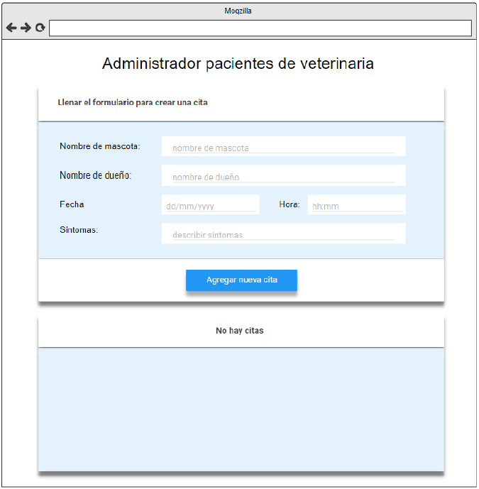
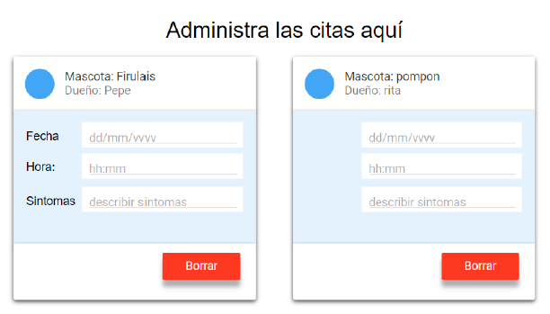

# Ejercicios React - Rolling Code School 
Prácticas con componentes, ciclo de vida del componente, eventos etc.

## Ejercicio N°9: Pacientes de veterinaria - Dificultad: 🟢🟡🔴
Crear una aplicación web que permite cargar un formulario para registrar una cita en una veterinaria, todos los datos solicitados en el formulario deben ser obligatorios.
La aplicación debe permitir borrar las citas y estas deben ser guardadas en el localstorage.

Si hay citas debo mostrarlas, con sus respectivos datos dentro de una card:

 

### Link de Deploy:
- [Netlify](https://lucasecapdevila-tpn9react76i.netlify.app/)
